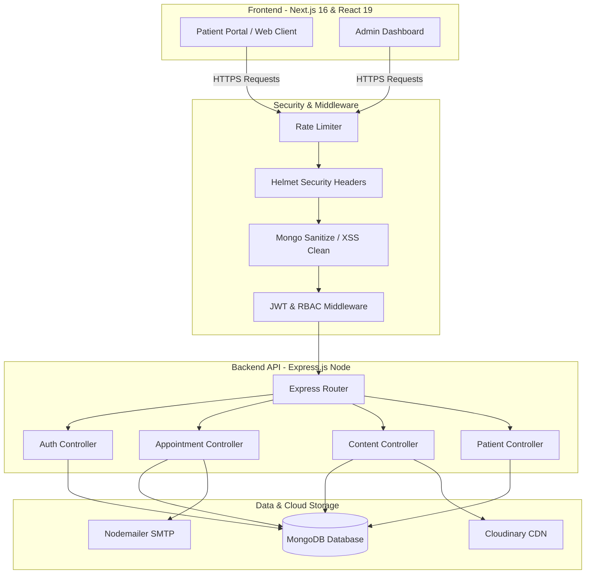

# Case Study: Aura Dental Clinic Management & Patient Engagement Platform

A modern, production-ready, full-stack application designed to streamline clinic operations, automate appointment scheduling, and enhance the patient engagement experience.

---

## 1. Executive Summary
**Aura Dental** is a comprehensive dental clinic software solution. It bridges the gap between patient-facing clinic marketing and internal clinical administration. By integrating a high-performance, SEO-optimized **Next.js 16** frontend with a secure, scalable **Express.js & MongoDB** backend, the platform automates booking workflows, secures patient records, and simplifies content management for clinic administrators.

---

## 2. System Architecture & Tech Stack
The platform uses a decoupled client-server architecture to ensure high performance, security, and independent scalability.

### Core Technologies
*   **Frontend**: Next.js 16 (App Router), React 19, Tailwind CSS (v4), Framer Motion & GSAP (for premium animations), React Hook Form, and Zod.
*   **Backend**: Node.js, Express.js, RESTful API architecture.
*   **Database**: MongoDB with Mongoose ODM.
*   **Storage & Utilities**: Cloudinary (media upload assets), Nodemailer (email notifications).
*   **Security & Protection**: JSON Web Tokens (JWT) with Refresh Tokens, BCrypt.js (password hashing), Helmet (HTTP headers protection), Express Rate Limit, Express Mongo Sanitize, and XSS Clean.

---

## 3. Key Modules & Features

### A. Patient Portal (Marketing & Engagement)
*   **Dynamic Landing Page**: Showcases treatments, client reviews, meet the doctors, and interactive trust metrics.
*   **Treatment Explorer**: Dedicated, dynamic pages for service categories (Diagnostics & Care, Restorations, and Cosmetic/Specialized).
*   **Appointment Booking Engine**: Interactive forms with validation (via Zod) to book appointments.
*   **Patient Insights & Care**: Resource pages for FAQs, testimonials, dental insights (blog), and insurance info.

### B. Admin Command Center
*   **Dynamic Dashboard**: Quick overview statistics (total appointments, patients, pending requests, and new messages).
*   **Appointment Manager**: Change status (Pending, Confirmed, Cancelled, Completed) with automatic email notifications.
*   **Patient Management Database**: Manage patient records, contact history, and historical appointments.
*   **CMS Controller**: Direct panels to manage treatment listings, update FAQ items, upload testimonials, and change clinic-wide configurations (e.g. business hours, contact numbers).
*   **Audit & Security Logs**: Tracks administrative activity logs to maintain operational accountability.

---

## 4. Database Schema Design (Core Entities)
The database structure is normalized yet optimized for MongoDB's document architecture:

| Collection | Key Fields | Purpose |
| :--- | :--- | :--- |
| **User / Admin** | `name`, `email`, `password`, `role`, `status` | Authentication & role-based dashboard access control |
| **Patient** | `name`, `phone`, `email`, `dateOfBirth`, `medicalHistory` | Core patient profiles and histories |
| **Appointment** | `patientId`, `doctorId`, `date`, `timeSlot`, `status`, `reason` | Schedules, status logs, and booking records |
| **Service / Treatment** | `name`, `slug`, `category`, `description`, `price` | Dynamic treatment services offered |
| **ActivityLog** | `userId`, `action`, `ipAddress`, `timestamp` | Internal audit logs tracking admin mutations |

---

## 5. Security & Performance Highlights
1.  **Rate Limiting**: Defends API routes against DDoS and brute-force attempts.
2.  **Strict Data Sanitization**: Prevents SQL/NoSQL Injection (`express-mongo-sanitize`) and Cross-Site Scripting (`xss-clean`).
3.  **Role-Based Access Control (RBAC)**: Validates requests at API gateways, ensuring standard admins cannot execute super-admin level actions.
4.  **Optimized Media Delivery**: Images are processed, compressed, and served globally through the Cloudinary CDN.
5.  **Clean Code Practices**: Modular file structure separating routes, controllers, validation schemas, and database middleware.
